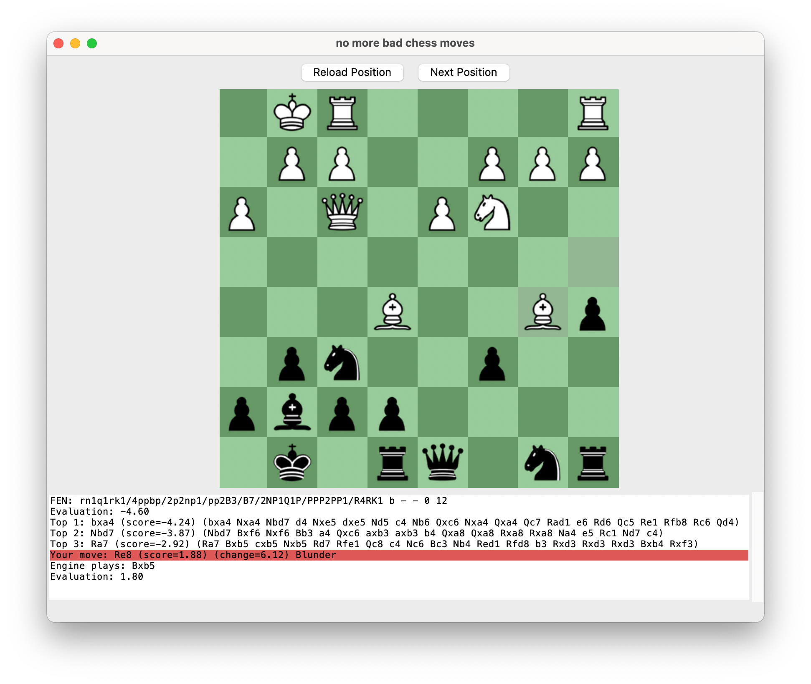

# no more bad chess moves

### Drill your blunder history to learn better moves

Have you hit a rating plateau? Are you doing lots of tactics but not seeing an improvement? Is your tactics rating much higher than your game rating?

This simple app can help!

Similar to tactical puzzles, you are shown a position then you choose a move. Unlike tactical puzzles, _many_ good moves might exist.

While most people review mistakes directly after a game, it's much harder to remember a mistake from the past. So instead of focussing on your last game, this app stores a whole history of positions you have found difficult. By going through your blunder history you can understand your mistakes deeply, gaining knowledge. Then you can drill those positions repeatedly to turn that knowledge into skill.
